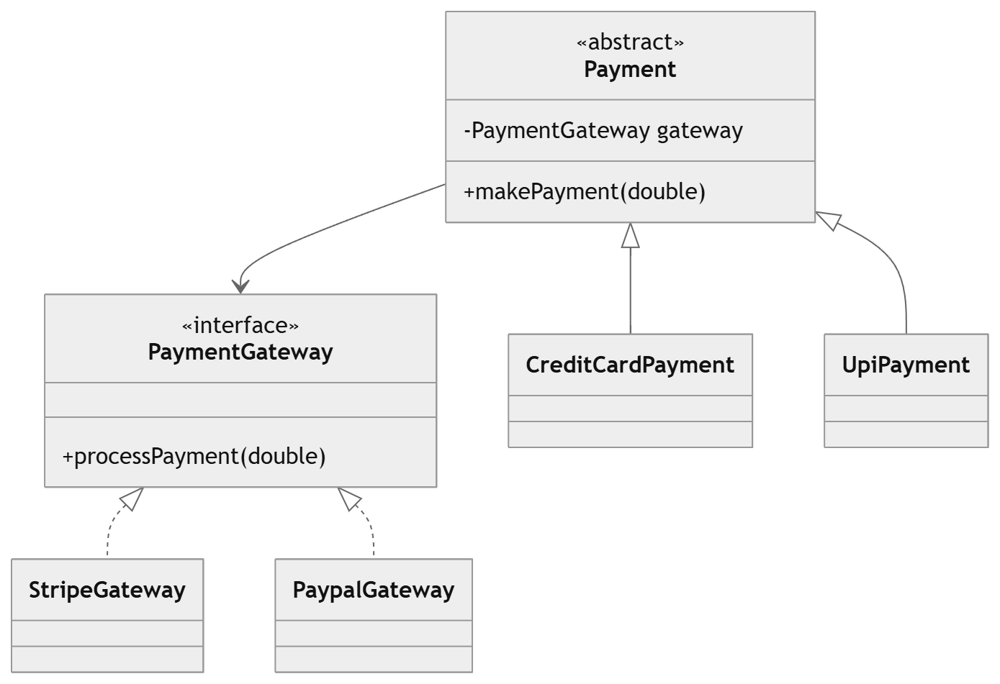

# Bridge Design Pattern – Payment Gateway Example 💳

This project demonstrates the **Bridge Design Pattern** using a **payment system example**.

The Bridge Pattern **decouples an abstraction from its implementation**, allowing both to vary independently. Here, **Payment Types** are the abstraction and **Payment Gateways** are the implementation.

In this example, the client can pay using **Credit Card** or **UPI** via different gateways like **Stripe** or **PayPal**, without creating a class for every combination.

---

# Features 🚀

* Demonstrates the **Bridge Design Pattern**
* Decouples **Payment Types** from **Payment Gateways**
* Supports **dynamic combinations** of payment type and gateway
* Easily extendable for new gateways or payment methods
* Mimics real-world payment processing systems

---

# Project Structure

```
BridgePatternPayment/
│
├── PaymentGateway
├── StripeGateway
├── PaypalGateway
├── Payment
├── CreditCardPayment
├── UpiPayment
└── Main
```

---

# Bridge Pattern Participants

## Implementation Interface

Represents the operations for the implementation hierarchy.

Class in this project:

* `PaymentGateway`

Concrete implementations:

* `StripeGateway`
* `PaypalGateway`

Responsibilities:

* Process payment requests

---

## Abstraction

Represents the abstraction hierarchy and delegates work to the implementation.

Class in this project:

* `Payment`

Refined abstractions:

* `CreditCardPayment`
* `UpiPayment`

Responsibilities:

* Define payment type behavior
* Forward request to gateway

---

## Client

Class in this project:

* `Main`

Responsibilities:

* Instantiate Payment with a specific Gateway
* Call `makePayment(amount)` to process payments

---

# Execution Flow

1. The **Client** creates a `Payment` object with a specific `PaymentGateway`.
2. Calls `makePayment(amount)`.
3. The `Payment` object forwards the request to the `PaymentGateway`.
4. The `PaymentGateway` processes the payment.


# Advantages

* Decouples payment type from payment gateway
* Supports dynamic combinations without creating multiple classes
* Follows **Open/Closed Principle**
* Mimics real-world systems efficiently
* Easy to add new payment types or gateways

---

# Real-World Analogy

```
Credit Card Payment → Stripe Gateway
UPI Payment → PayPal Gateway
```

* Payment Type → Abstraction
* Payment Gateway → Implementation
* Client can dynamically combine them

---

# When to Use Bridge Pattern

* Two independent dimensions may vary
* Avoid class explosion
* Want to change abstraction and implementation independently

Examples:

* Payment → Payment Gateway
* Shape → Color
* Remote → Device
* Document → Renderer
* 
  