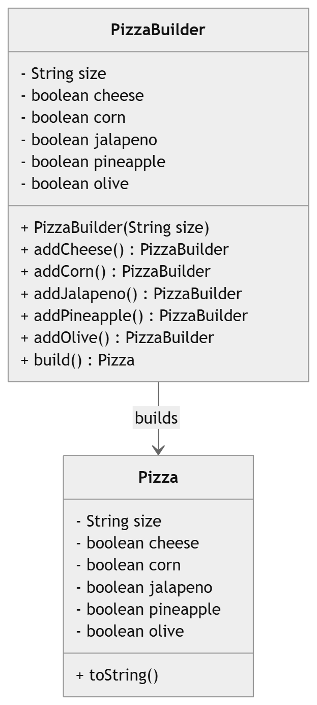

# Pizza Builder Pattern Example

This project demonstrates the **Builder Design Pattern** in Java using a `Pizza` object. The builder allows creating complex `Pizza` objects step-by-step with optional toppings.

## Classes

### 1. Pizza (Product)
Represents a pizza with required and optional toppings.

**Fields:**
- `size` (required)
- `cheese` (optional)
- `corn` (optional)
- `jalapeno` (optional)
- `pineapple` (optional)
- `olive` (optional)

**Constructor:**  
Package-private constructor used by the builder:

```java
Pizza(String size, boolean cheese, boolean corn, boolean jalapeno, boolean pineapple, boolean olive)
```
