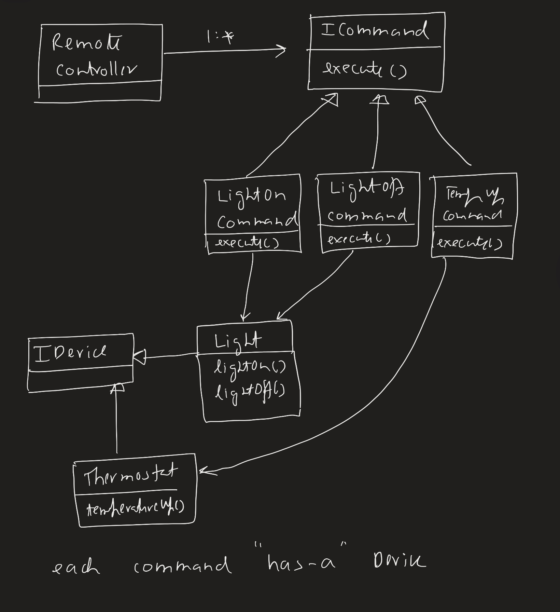

There is a sender and a receiver. The sender sends the receiver a command.
This design pattern encapsulate the command that is being sent.

For example,
1. We have an Alexa device which controls several hardwares like,
   - thermostat increase/decrease temperature 
   - light bulb on/off
   - music start/stop/pause/next song 
2. We want to program Alexa such that it can take in voice commands from user and execute certain commands based on the voice input.
3. The Alexa is the remote controller here.
4. There are 3 hardwares which Alexa sends commands to. These hardwares have the actual code as to what to do when the `execute` order is received.
   - Thermostat
   - Bulb 
   - Music Player
5. Note that Alexa just calls a command, it doesn't know what the command does.
6. The starting point of this pattern are the hardware devices which actually have the logic of doing stuff for example, turning light on. Alexa just knows which command to call when this command is called.

The flow is,
1. User (Main) programs Alexa which command (C1) to execute when it hears certain orders.
2. Alexa invokes that corresponding command (C1).
3. The command (C1) knows which hardware method to call when it is invoked.

