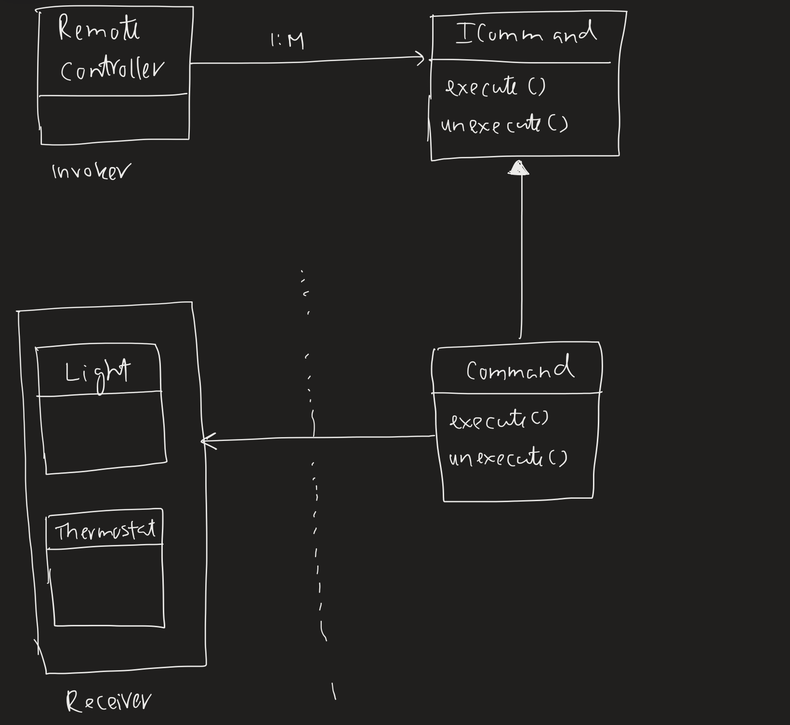

There is a sender and a receiver. The sender sends the receiver a command.
This design pattern encapsulate the command that is being sent.

For example,
1. There is a universal remote controller, which is the invoker.
2. There are many appliances like bulb, thermostat, etc which are the receiver.
3. There are commands which we inject into the remote controller.

