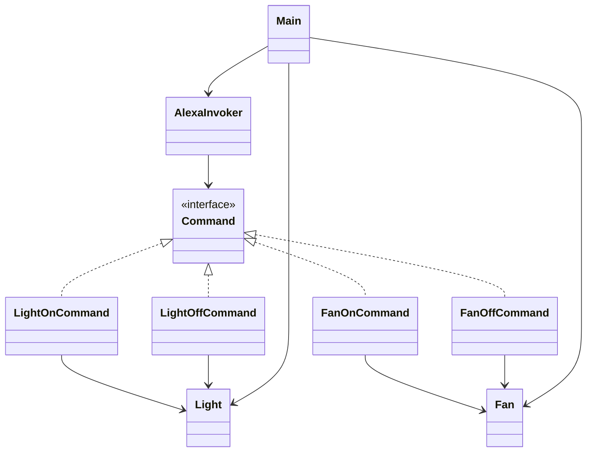
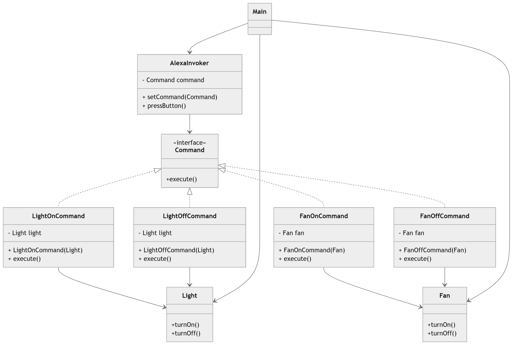

# Command Design Pattern – Alexa Home Automation Example 🔘🏠

This project demonstrates the **Command Design Pattern** using a simple **Alexa home automation simulation**.

Alexa acts as a **remote controller (Invoker)** that can execute commands to control smart devices such as **Light** and **Fan**.

The Command Pattern encapsulates a request as an object, allowing the **Invoker** to trigger operations without knowing the details of the **Receiver**.

---

# Features 🚀

* Demonstrates the **Command Design Pattern**
* Simulates **Alexa controlling smart home devices**
* Supports multiple commands:

    * Turn **Light ON/OFF**
    * Turn **Fan ON/OFF**
* Shows **decoupling between invoker and receiver**
* Easily extendable to support new devices or commands

---

# Problem Statement

If Alexa directly invoked device methods such as turning on a light or fan, it would become tightly coupled with each device implementation.

Adding new devices like **TV**, **AC**, or **Garage Door** would require modifying the Alexa controller.

The **Command Pattern** solves this by encapsulating each request as a **command object**, allowing Alexa to trigger commands without knowing the details of the device.

---

# Class Diagram



---

# Project Structure

```
CommandPattern/
│
├── Command
├── LightOnCommand
├── LightOffCommand
├── FanOnCommand
├── FanOffCommand
├── Light
├── Fan
├── AlexaInvoker
└── Main
```

---

# Command Pattern Participants

## Command Interface

Represents the **command abstraction** that declares the operation to execute.

Class in this project:

* `Command`

---

## Concrete Commands

Concrete commands implement the command interface and bind the **receiver** with a specific action.

Classes in this project:

* `LightOnCommand`
* `LightOffCommand`
* `FanOnCommand`
* `FanOffCommand`

Each command triggers a specific operation on its associated receiver.

---

## Receiver

Receivers contain the actual functionality that performs the requested operation.

Classes in this project:

* `Light`
* `Fan`

These classes define operations for turning the devices **on** or **off**.

---

## Invoker

The invoker triggers the command but does not know the details of the operation being performed.

Class in this project:

* `AlexaInvoker`

AlexaInvoker sets a command and executes it when the button is pressed.

---

## Client

The client creates command objects and connects them with receivers.

Class in this project:

* `Main`

The client configures Alexa with different commands and triggers them.

---

# Execution Flow

1. The **Client (Main)** creates receiver objects.
2. The client creates **Concrete Command objects** and associates them with receivers.
3. The client sets a command in the **Invoker (AlexaInvoker)**.
4. The invoker triggers the command when the button is pressed.
5. The command calls the appropriate method on the **Receiver**.

---

# Advantages

* Decouples the **Invoker** from the **Receiver**
* Makes it easy to add new commands without changing existing code
* Supports extensibility for new devices
* Encourages clean and maintainable design
* Can be extended to support **undo/redo operations**

