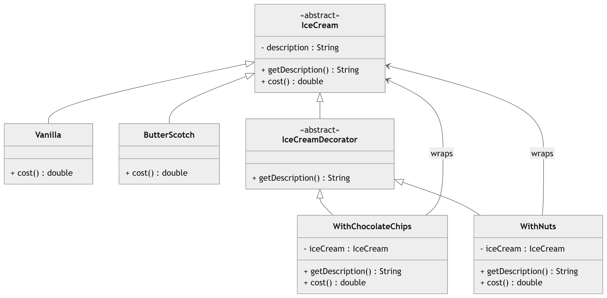

# Decorator Design Pattern – Ice Cream Example 🍨

This project demonstrates the **Decorator Design Pattern** using a simple Ice Cream ordering system.

The **Decorator Pattern** allows behavior to be added to objects dynamically without modifying the original class. It helps avoid creating many subclasses for every possible combination of features.

In this example:

Base Ice Creams:

* Vanilla
* Butterscotch

Optional Toppings (Decorators):

* Chocolate Chips
* Nuts

Decorators wrap an existing `IceCream` object and add additional functionality such as description and cost.

---

# Class Diagram


# Project Structure

```
Decorator/
│
├── IceCream.java
├── IceCreamDecorator.java
├── Vanilla.java
├── ButterScotch.java
├── WithChocolateChips.java
├── WithNuts.java
└── Main.java
```


# Advantages

* Follows **Open/Closed Principle**
* Avoids **large inheritance hierarchies**
* Adds behavior **dynamically**
* Flexible combination of features

---

# Key Concept

Instead of creating subclasses for every topping combination, decorators **wrap objects and add functionality dynamically**.
