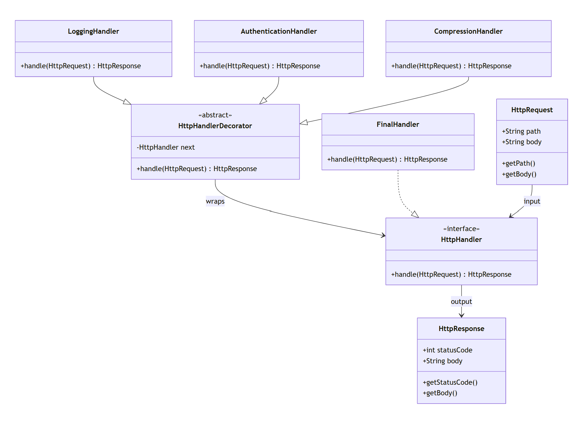

# Summary
PS: For simpler example, see `IceCream`.

This example uses Decorator pattern to ingest a HTTP request, does a variety of 
processing and finally returns a response.

The pipeline processes an incoming HttpRequest through a chain of decorators. Each decorator can:
1. Inspect or modify the request 
2. Short‑circuit the pipeline 
3. Pass the request to the next handler 
4. Inspect or modify the response 
5. The final output is an HttpResponse.

```
HttpRequest
    │
    ▼
LoggingHandler
    │
    ▼
AuthenticationHandler
    │
    ▼
CompressionHandler
    │
    ▼
FinalHandler  ← (terminal handler)
    │
    ▼
HttpResponse

```

# Class‑by‑Class Explanation
## HttpRequest
Represents an incoming HTTP request. 
1. Contains path and body 
2. Passed through the entire pipeline
### Used by:  
All handlers (HttpHandler implementations)
   
## HttpResponse
Represents the final output of the pipeline.
1. Contains statusCode and body
2. Returned by every handler
### Returned by:  
All handlers

## HttpHandler (Interface)
The core contract for all pipeline components.
### Implemented by:
1. HttpHandlerDecorator 
2. FinalHandler 
3. All concrete decorators

## HttpHandlerDecorator (Abstract)
Base class for all decorators.
1. Stores a reference to the next handler 
2. Implements the default behavior: return next.handle(request);
### Extended by:
1. LoggingHandler 
2. AuthenticationHandler 
3. CompressionHandler

## Concrete Decorators
1. LoggingHandler
2. AuthenticationHandler
3. CompressionHandler
4. FinalHandler

## PipelineBuilder
A builder that assembles the pipeline.
### Responsibilities:
1. Collect decorator factories (Function<HttpHandler, HttpHandler>)
2. Accept a terminal handler 
3. Build the chain in reverse order

# UML Diagram
Transforms `HttpRequest` to `HttpResponse`  

