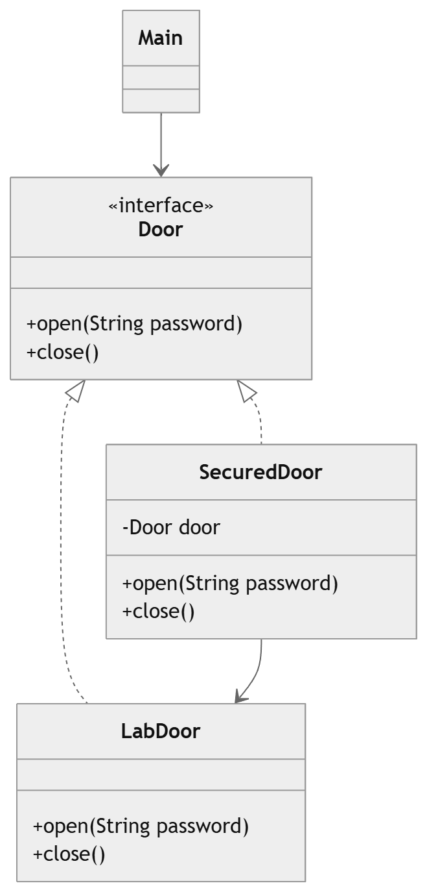

# Proxy Design Pattern – Secured Door Example 🚪🔐

This project demonstrates the **Proxy Design Pattern** using a simple **door security system**.

The proxy pattern provides a **surrogate or placeholder for another object** to control access to it.
Instead of directly interacting with the real object, the client interacts with a **proxy**, which may perform additional operations such as **authentication, logging, or access control**.

In this example, a **SecuredDoor** acts as a proxy to a **LabDoor** and ensures that only users with the correct password can open the door.

---

# Features 🚀

* Demonstrates the **Proxy Design Pattern**
* Shows how to **control access to an object**
* Implements **password-based security**
* Maintains **loose coupling between client and real object**
* Easily extendable for more security checks or logging

---

# Project Structure

```
ProxyPattern/
│
├── Door
├── LabDoor
├── SecuredDoor
└── Main
```

---

# Proxy Pattern Participants

## Subject

Represents the common interface that both the **real object** and the **proxy** implement.

Class in this project:

* `Door`

This interface defines operations that can be performed on a door.

---

## Real Subject

The **real object** that performs the actual operation.

Class in this project:

* `LabDoor`

This class implements the door functionality such as opening and closing the lab door.

---

## Proxy

The proxy controls access to the real object.

Class in this project:

* `SecuredDoor`

Responsibilities:

* Holds a reference to `Door`
* Verifies the password
* Allows or denies access to the real door

---

## Client

The client interacts with the proxy instead of the real object.

Class in this project:

* `Main`

The client creates the proxy and attempts to open the door using a password.

---

# Execution Flow

1. The **Client** creates a `SecuredDoor` object.
2. `SecuredDoor` holds a reference to `LabDoor`.
3. The client calls `open(password)`.
4. The proxy validates the password.
5. If authentication succeeds, the proxy forwards the request to `LabDoor`.
6. Otherwise, access is denied.

Flow:

```
Client
   ↓
SecuredDoor (Proxy)
   ↓ authentication
LabDoor (Real Object)
```

---

# Advantages

* Controls access to sensitive objects
* Adds security without modifying the real object
* Follows the **Open/Closed Principle**
* Allows additional behavior such as logging or caching

---

# Real World Analogy

A **security guard at a restricted lab** acts as a proxy.

```
Employee → Security Guard → Research Lab
```

* Security Guard → Proxy
* Lab → Real Object
* ID verification → Access control
  