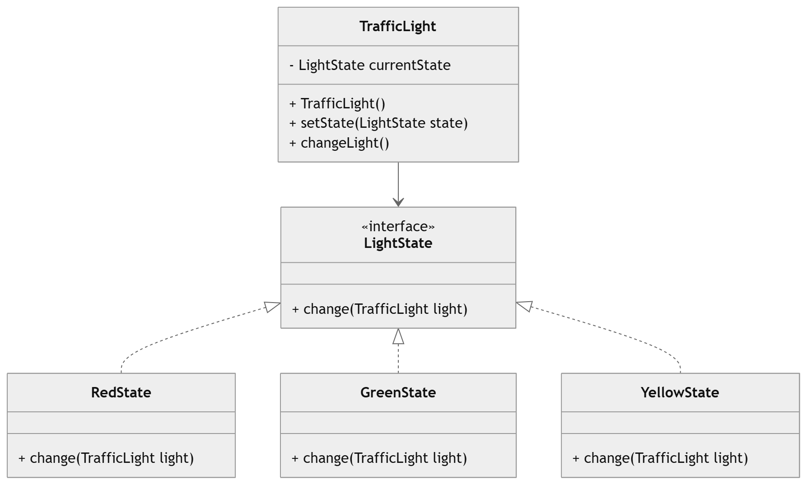

# Traffic Light System (LLD - State Design Pattern)

## Overview

This project demonstrates the **Low Level Design (LLD)** of a **Traffic Light System** implemented in Java using the **State Design Pattern**.

A traffic light behaves differently depending on its **current state**. For example:

* **Red** → Stop
* **Green** → Go
* **Yellow** → Slow down

Instead of using complex `if-else` logic to manage transitions, the **State Pattern** encapsulates each state into a separate class. This makes the system more **maintainable, extensible, and scalable**.

---

# Design Pattern Used

## State Design Pattern

The **State Pattern** allows an object to change its behavior when its internal state changes.

### Components

* **Context:** `TrafficLight`
* **State Interface:** `LightState`
* **Concrete States:**

    * `RedState`
    * `GreenState`
    * `YellowState`

Each state controls the transition to the **next state**.

---

# System Components

## 1. TrafficLight (Context)

The `TrafficLight` class maintains the **current state** of the traffic signal and delegates behavior to the state object.

### Responsibilities

* 
  