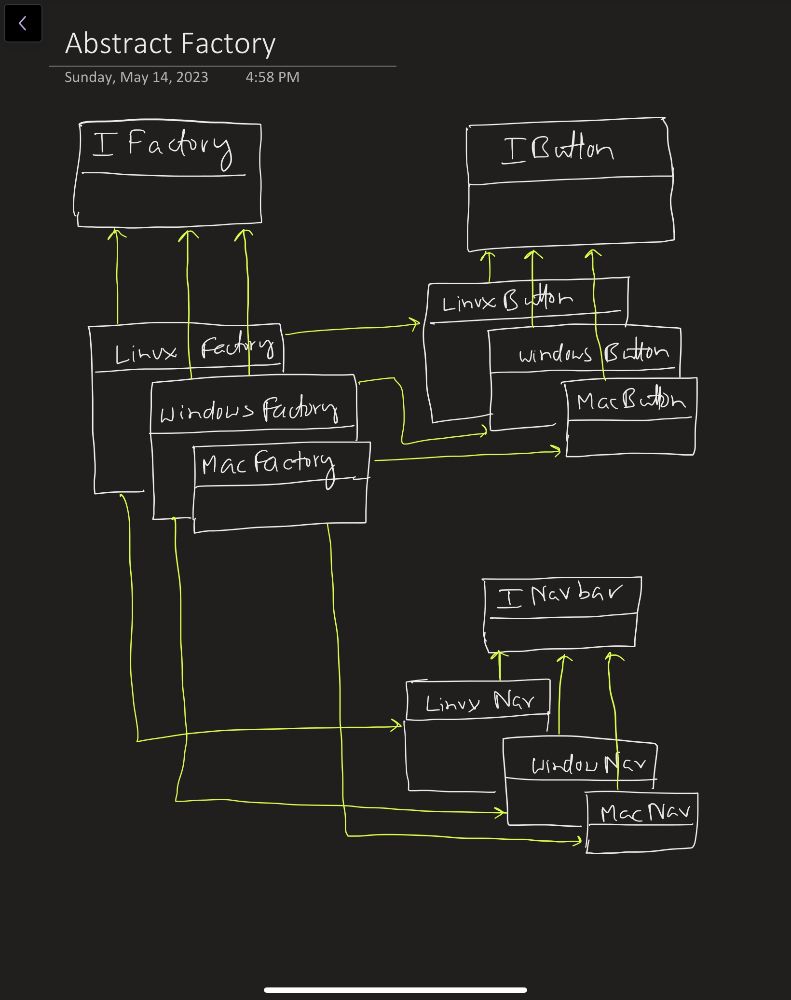

# Factory Pattern

Why do we need this pattern when we have 
`ClassName className = new ClassName();`

Suppose we have an `Animal` class and 2 child classes `Dog`, `Cat` and `Rabbit`. We want 2 different ways to create animals, 
1. Random creation: `Dog`, `Cat` and `Rabbit` are randomly created. 3 consecutive `Cat` or `Dog` should not be created.
2. Balanced creation: Almost equal number of `Dog`, `Cat` and `Rabbit` should be created. 

We thus, will need to write a wrapper over `AnimalFactory` which will take care of this logic.

**IAnimal** -> **Animal**
1. Cat
2. Dog
3. Rabbit

**IAnimalFactory**
1. BalancedAnimalFactory
2. RandomAnimalFactory

Note that the factory classes and the actual classes are not linked in any way.
The concrete factories (BalancedAnimalFactory, RandomAnimalFactory) just return the concrete actual classes (Cat, Dog, Rabbit).

# Abstract Factory Pattern
Suppose we have 3 OS - Linux, Mac and Windows. We want to create navbars and buttons.
Our factory should be smart enough to realize that whenever a navbar is created for Windows the button should also be created for Windows.
Is should not be the case that navbar is of Windows and button is of Mac.

So the `IFactory` has 3 concrete factories
1. Mac Factory
2. Linux Factory
3. Windows Factory

Each of these will create 
1. Mac Navbar + Mac Button
2. Linux Navbar + Linux Button
3. Windows Navbar + Windows Button
