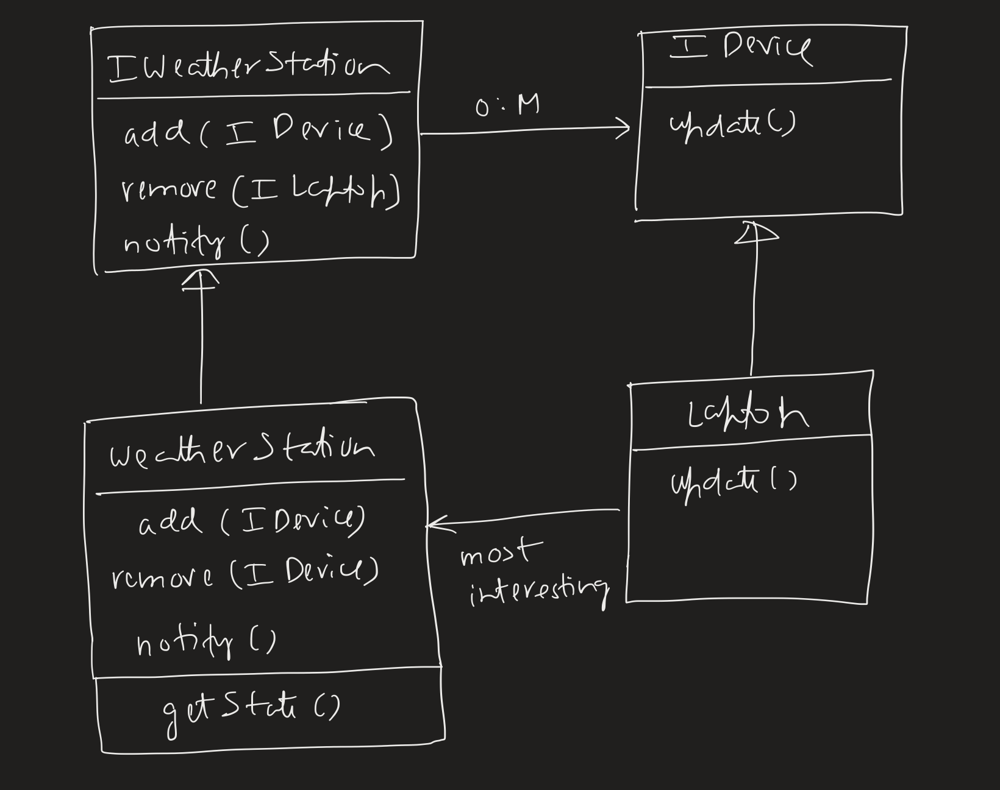

# Observable Pattern
Push notification.

We have a `WeatherStation` which is observing the temperature and humidity.
When these change, the display of devices which have subscribed to them change.

## Interesting Note
The most **interesting** part is that `Laptop` has-a `WeatherStation` and the `getState()` function. Why do we need it?
We shouldn't need that arrow since, the pattern by definition is just a push notification from `WeatherStation` to the `Laptop`, so why have the `WeatherStation` reference in `Laptop` then?.

NOTE: The `IDisplay` class is not strictly part of the pattern but added here cause it makes sense since, every device will implement its own `Display`.

While yes its true we don't need all these for the push notification but without these the `Laptop` has no way of knowing what has changed i.e. what's the latest state of temperature and humidity?

