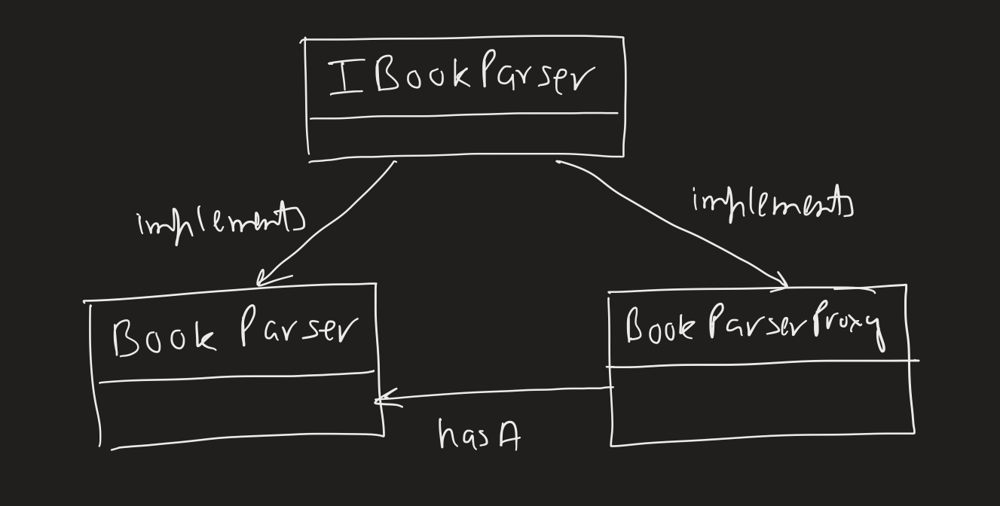

# Proxy Pattern
Suppose we have a `Client` and a `BookParser`. The client instead of calling 
the `BookParser` directly calls the `BookParserProxy`. 
`BookParserProxy` introduces additional functionality for exaple,
1. authentication
2. intercepting a remote call. In this case the proxy might be making a network call but returning a promise to the client immediately. The promise will be called when the network call gets back with response.
3. caching. The `Server` operations might be an expensive operation and we might want to cache the result. So instead of writing the cache logic everywhere in the `Client` code we proxy the calls.

## Adapter vs Proxy
Adapter pattern lets the client adapt to the interface of the server such that even if the server changes the client is oblivious to it.
In proxy pattern however, the client's and the server's interface remain the same. The proxy just adds additional functionality by intercepting the request.

In our example, we have the `BookParser` class constructor which is super expensive as it makes several network calls to set things up.
The `BookParser` also has several cheap methods which return values set during the class construction itself (hence, they are cheap) like `CountNumberOPfages`.
But we might never need to call the `CountNumberOfPages` method in the `Client` code, kind of lazy initialize. Thus, client creates the `BookParserProxy` without any worry about if or not the `CountNumberOfPages` will be used.
The proxy class takes care of that.
