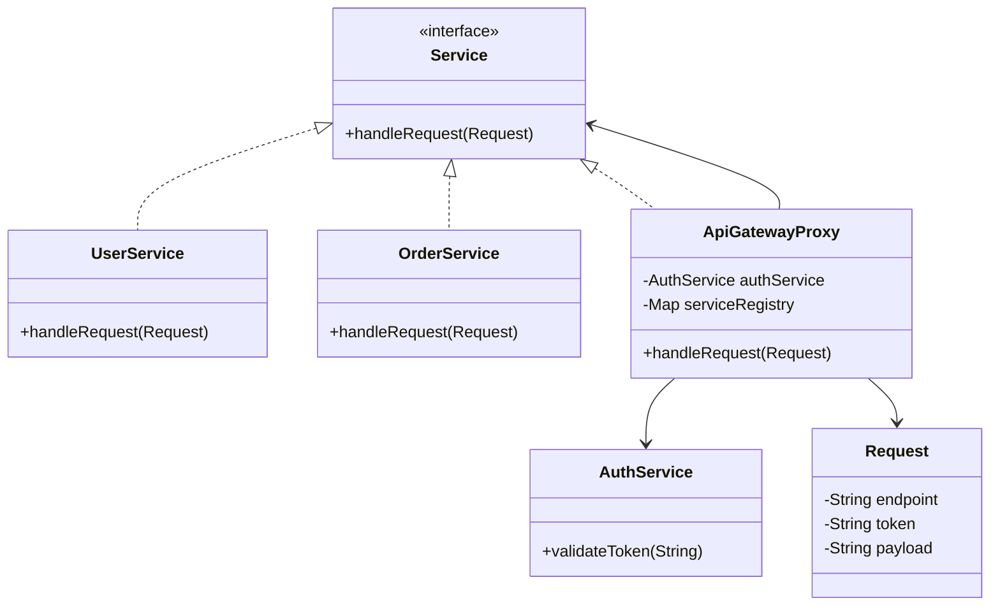
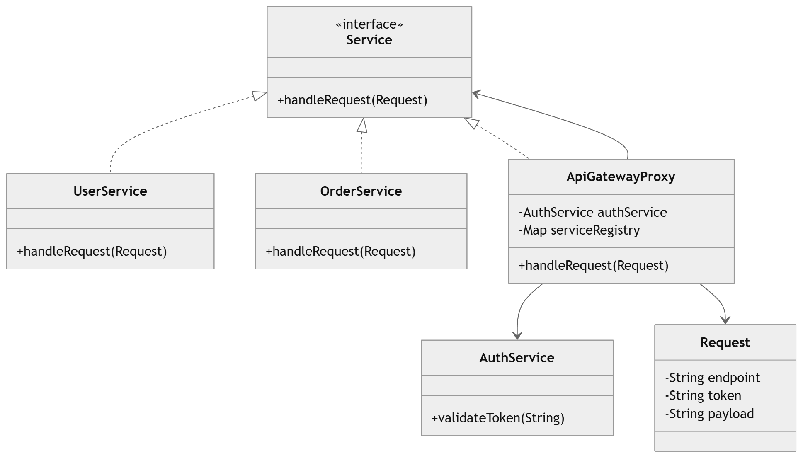

# API Gateway with Authentication – Low Level Design (LLD)

## Overview

An **API Gateway** acts as a single entry point for all client requests in a microservices architecture.
Instead of clients directly calling backend services, they send requests to the **API Gateway**, which performs cross-cutting concerns such as:

* Authentication
* Authorization
* Rate limiting
* Logging
* Request routing

In this design, the **API Gateway acts as a Proxy** for backend services.

```
Client → API Gateway → Backend Services
```

---

# Design Pattern Used

## Proxy Pattern

The **Proxy Pattern** provides a placeholder or intermediary that **controls access to another object**.

In this design:

```
Client → ApiGatewayProxy → Real Services
```

The proxy performs:

* Authentication
* Logging
* Routing

before forwarding the request to the real service.

---

# High Level Architecture

```
Client
   |
   v
API Gateway (Proxy)
   |
   |---- Auth Service
   |
   v
Backend Services
   |---- User Service
   |---- Order Service
```

---

# Core Components

### Client

Sends HTTP/API requests.

### API Gateway (Proxy)

* Validates authentication token
* Routes request to the correct backend service
* Handles logging and rate limiting

### AuthService

Validates user authentication tokens.

### Backend Services

Actual services that process business logic.

Examples:

* `UserService`
* `OrderService`

---

# Class Design

```
Service (interface)
      |
      |
-------------------------
|                       |
UserService          OrderService
(real services)

ApiGatewayProxy (Proxy)
AuthService
Request
Response
```

---

# Request Model

```java
public class Request {

    private String endpoint;
    private String token;
    private String payload;

    public Request(String endpoint, String token, String payload) {
        this.endpoint = endpoint;
        this.token = token;
        this.payload = payload;
    }

    public String getEndpoint() {
        return endpoint;
    }

    public String getToken() {
        return token;
    }

    public String getPayload() {
        return payload;
    }
}
```

---

# Service Interface

```java
public interface Service {

    String handleRequest(Request request);
}
```

All backend services implement this interface.

---

# Backend Services

## User Service

```java
public class UserService implements Service {

    @Override
    public String handleRequest(Request request) {
        return "User service processing request: " + request.getPayload();
    }
}
```

---

## Order Service

```java
public class OrderService implements Service {

    @Override
    public String handleRequest(Request request) {
        return "Order service processing request: " + request.getPayload();
    }
}
```

---

# Authentication Service

```java
public class AuthService {

    public boolean validateToken(String token) {
        return token.equals("valid-token");
    }
}
```

This service validates authentication tokens before allowing access to backend services.

---

# API Gateway Proxy

The **API Gateway acts as a proxy** and handles authentication and routing.

```java
import java.util.Map;

public class ApiGatewayProxy implements Service {

    private AuthService authService;
    private Map<String, Service> serviceRegistry;

    public ApiGatewayProxy(AuthService authService,
                           Map<String, Service> serviceRegistry) {
        this.authService = authService;
        this.serviceRegistry = serviceRegistry;
    }

    @Override
    public String handleRequest(Request request) {

        // Step 1: Authenticate request
        if (!authService.validateToken(request.getToken())) {
            return "Authentication Failed";
        }

        // Step 2: Find service
        Service service = serviceRegistry.get(request.getEndpoint());

        if (service == null) {
            return "Service not found";
        }

        // Step 3: Forward request
        return service.handleRequest(request);
    }
}
```

---

# Client Example

```java
import java.util.HashMap;
import java.util.Map;

public class Main {

    public static void main(String[] args) {

        AuthService authService = new AuthService();

        Map<String, Service> services = new HashMap<>();
        services.put("/users", new UserService());
        services.put("/orders", new OrderService());

        Service apiGateway =
                new ApiGatewayProxy(authService, services);

        Request request =
                new Request("/users", "valid-token", "Get User Details");

        System.out.println(apiGateway.handleRequest(request));
    }
}
```

### Output

```
User service processing request: Get User Details
```

If the token is invalid:

```
Authentication Failed
```

---

# UML Class Diagram



---

# Request Flow

```
Client
   |
   v
API Gateway Proxy
   |
   |-- Validate Token
   |-- Log Request
   |-- Rate Limit
   |
   v
Route Request to Backend Service
   |
   v
Backend Service Processes Request
```

---

# Real World Systems Using This Design

Examples of API Gateway proxies used in production systems:

* AWS API Gateway
* Netflix Zuul
* Kong API Gateway
* NGINX Reverse Proxy
* Spring Cloud Gateway

These systems act as **proxies in front of microservices** and handle authentication, routing, and security.

---

# Possible Improvements

### Add Rate Limiting

Introduce a `RateLimiterService` to limit excessive requests.

### Add Logging

Introduce a logging component to log incoming requests and responses.

### Service Discovery

Replace static service registry with dynamic discovery:

* Eureka
* Consul
* Kubernetes Service Discovery

### Circuit Breaker

Add fault tolerance using patterns like:

* Circuit Breaker
* Retry
* Timeout

---

# Summary

| Feature            | Implementation            |
| ------------------ | ------------------------- |
| Single Entry Point | API Gateway               |
| Authentication     | AuthService               |
| Routing            | Service Registry          |
| Design Pattern     | Proxy Pattern             |
| Backend Services   | UserService, OrderService |

The **API Gateway acts as a Proxy**, controlling access to backend services while adding authentication, routing, and other cross-cutting concerns.

