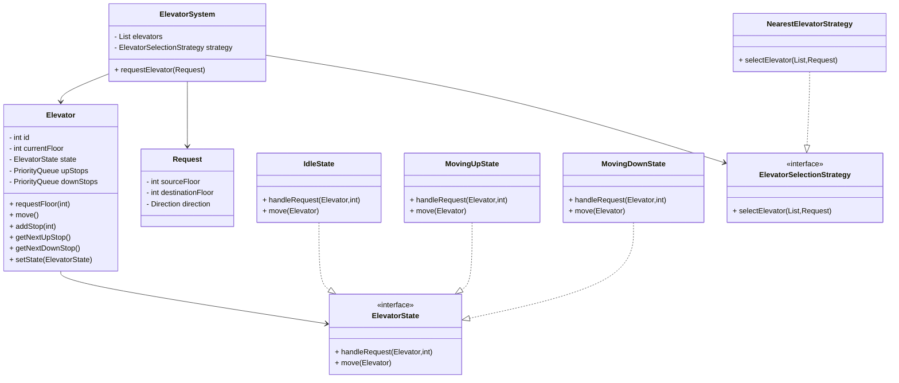
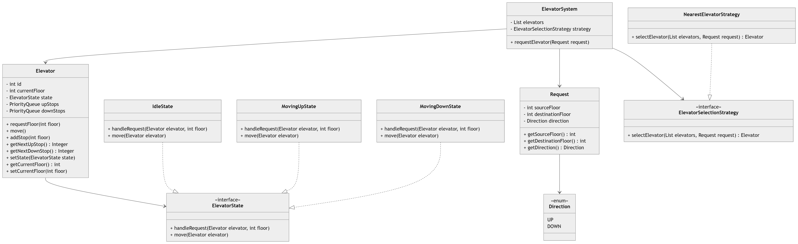

# Elevator System – Low Level Design (LLD)

## Overview

This project implements a **multi-elevator control system** in Java using core **Object-Oriented Design principles** and common **design patterns used in real-world systems**.

The system simulates how elevators handle requests, select the best elevator, and move between floors while dynamically changing behavior based on their **current state**.

The design demonstrates concepts commonly evaluated in **Low-Level Design (LLD) interviews**.

Key highlights:

* Multiple elevators in a building
* Elevator request handling
* Elevator scheduling using a **Strategy Pattern**
* Elevator behavior management using the **State Pattern**
* Clean, modular, and extensible architecture

---

# Functional Requirements

1. A building contains **multiple elevators**
2. Users can request an elevator from any floor
3. Users specify a **destination floor**
4. Elevator moves in **UP or DOWN direction**
5. The system selects the **most appropriate elevator**
6. Elevator behavior changes depending on its **state**

---

# Non-Functional Requirements

* Scalable for multiple elevators
* Easy to introduce new scheduling algorithms
* Maintainable and modular design
* Extensible for concurrency and advanced scheduling

---

# Design Patterns Used

## 1. State Pattern

The **State Pattern** allows an object to change its behavior when its internal state changes.

Instead of using multiple conditional checks such as:

```
if(state == IDLE)
if(state == MOVING)
```

the behavior is encapsulated inside **state classes**.

Elevator states:

* **IdleState**
* **MovingUpState**
* **MovingDownState**

Each state controls how the elevator handles requests and movement.

---

## 2. Strategy Pattern

Used to determine **which elevator should handle a request**.

This allows the scheduling algorithm to be swapped easily.

Examples:

* Nearest Elevator Strategy
* SCAN algorithm
* LOOK algorithm

---

## 3. Singleton Pattern

`ElevatorSystem` is implemented as a **Singleton** so that only one instance manages all elevators within a building.

---

# System Components

## ElevatorSystem

Responsible for:

* Managing all elevators
* Receiving elevator requests
* Delegating elevator selection to a strategy

---

## Elevator

Represents a single elevator.

Responsibilities:

* Maintain current floor
* Maintain stop queues
* Maintain current state
* Delegate behavior to the current state object

---

## Request

Represents a user's elevator request.

Attributes:

* Source floor
* Destination floor
* Direction

---

## ElevatorSelectionStrategy

Defines how the system chooses the best elevator for a request.

Example implementation:

* `NearestElevatorStrategy`

---

# State Pattern Implementation

## ElevatorState Interface

Defines behavior common to all states.

```java
public interface ElevatorState {

    void handleRequest(Elevator elevator, int floor);

    void move(Elevator elevator);
}
```

---

## IdleState

When idle, the elevator determines which direction it should move.

```java
public class IdleState implements ElevatorState {

    @Override
    public void handleRequest(Elevator elevator, int floor) {

        if (floor > elevator.getCurrentFloor()) {
            elevator.setState(new MovingUpState());
        } else if (floor < elevator.getCurrentFloor()) {
            elevator.setState(new MovingDownState());
        }

        elevator.addStop(floor);
    }

    @Override
    public void move(Elevator elevator) {
        System.out.println("Elevator is idle at floor " + elevator.getCurrentFloor());
    }
}
```

---

## MovingUpState

Handles elevator movement when traveling upward.

```java
public class MovingUpState implements ElevatorState {

    @Override
    public void handleRequest(Elevator elevator, int floor) {
        elevator.addStop(floor);
    }

    @Override
    public void move(Elevator elevator) {

        Integer nextFloor = elevator.getNextUpStop();

        if (nextFloor == null) {
            elevator.setState(new IdleState());
            return;
        }

        System.out.println("Elevator moving UP to floor " + nextFloor);
        elevator.setCurrentFloor(nextFloor);
    }
}
```

---

## MovingDownState

Handles elevator movement when traveling downward.

```java
public class MovingDownState implements ElevatorState {

    @Override
    public void handleRequest(Elevator elevator, int floor) {
        elevator.addStop(floor);
    }

    @Override
    public void move(Elevator elevator) {

        Integer nextFloor = elevator.getNextDownStop();

        if (nextFloor == null) {
            elevator.setState(new IdleState());
            return;
        }

        System.out.println("Elevator moving DOWN to floor " + nextFloor);
        elevator.setCurrentFloor(nextFloor);
    }
}
```

---

# Elevator Class

The elevator delegates behavior to the **current state**.

```java
public class Elevator {

    private int id;
    private int currentFloor;
    private ElevatorState state;

    private PriorityQueue<Integer> upStops;
    private PriorityQueue<Integer> downStops;

    public Elevator(int id) {
        this.id = id;
        this.currentFloor = 0;
        this.state = new IdleState();

        upStops = new PriorityQueue<>();
        downStops = new PriorityQueue<>((a, b) -> b - a);
    }

    public void requestFloor(int floor) {
        state.handleRequest(this, floor);
    }

    public void move() {
        state.move(this);
    }

    public void setState(ElevatorState state) {
        this.state = state;
    }

    public void addStop(int floor) {
        if (floor > currentFloor)
            upStops.add(floor);
        else
            downStops.add(floor);
    }

    public Integer getNextUpStop() {
        return upStops.poll();
    }

    public Integer getNextDownStop() {
        return downStops.poll();
    }

    public int getCurrentFloor() {
        return currentFloor;
    }

    public void setCurrentFloor(int floor) {
        this.currentFloor = floor;
    }
}
```

---

# Project Structure

```
elevator-system
│
├── Client.java
├── ElevatorSystem.java
├── Elevator.java
├── Request.java
│
├── state
│   ├── ElevatorState.java
│   ├── IdleState.java
│   ├── MovingUpState.java
│   └── MovingDownState.java
│
├── strategy
│   ├── ElevatorSelectionStrategy.java
│   └── NearestElevatorStrategy.java
```

---

# UML Class Diagram



---

# Example Client Code

```java
public class Client {

    public static void main(String[] args) {

        Elevator elevator = new Elevator(1);

        elevator.requestFloor(5);
        elevator.move();

        elevator.requestFloor(2);
        elevator.move();
    }
}
```

---

# Example

