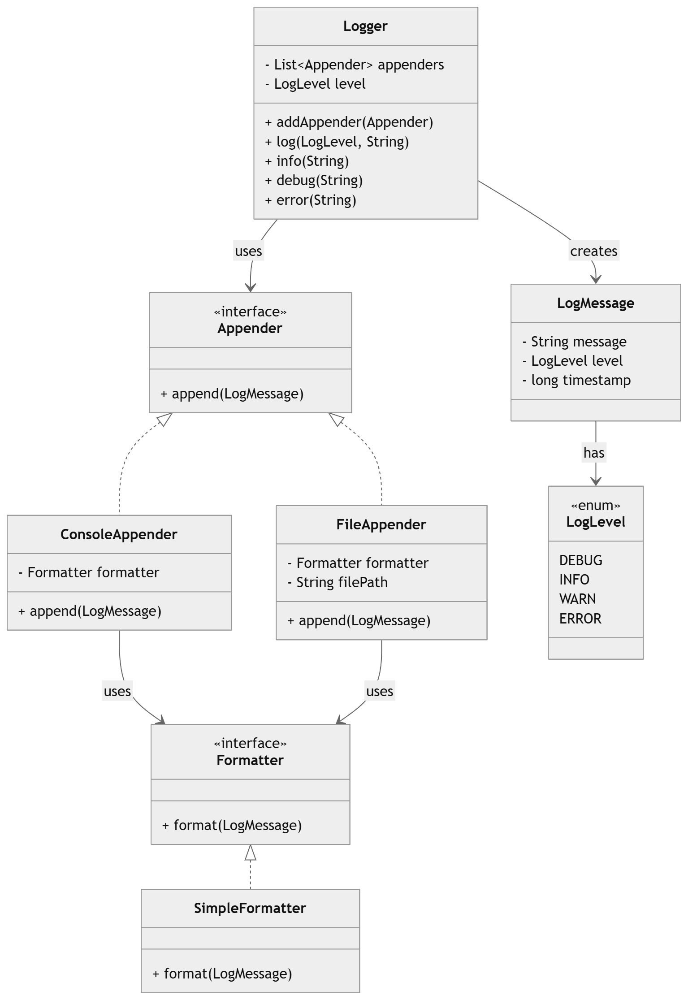

# 🧾 Logging Framework Design (LLD)

## 📌 Overview

This project demonstrates a simple, extensible **Logging Framework** built using core Object-Oriented Design principles and common design patterns.

The system supports:

* Multiple log levels (DEBUG, INFO, WARN, ERROR)
* Multiple output destinations (Console, File)
* Custom formatting
* Extensibility for future enhancements (DB, Kafka, etc.)

---

## 🏗️ Architecture

```text
Logger → LogMessage → Appender → Formatter
```

* **Logger**: Entry point for logging
* **LogMessage**: Encapsulates log data
* **Appender**: Defines output destination
* **Formatter**: Formats log message

---

## 🎯 Features

* Pluggable appenders (Console, File)
* Configurable log levels
* Separation of concerns
* Easy to extend with new outputs or formats

---

## 🧠 Design Patterns Used

### 1. Strategy Pattern

* Used for **Appender** and **Formatter**
* Allows switching behavior at runtime

### 2. Open/Closed Principle

* New appenders or formatters can be added without modifying existing code

---

## 📦 Components

### 🔹 LogLevel (Enum)

Defines logging levels:

* DEBUG
* INFO
* WARN
* ERROR

---

### 🔹 LogMessage

Encapsulates:

* Message
* Log level
* Timestamp

---

### 🔹 Formatter

Responsible for formatting log messages.

Example:

```
2026-03-27 [INFO] Application started
```

---

### 🔹 Appender

Defines where logs are written.

#### ConsoleAppender

* Writes logs to console

#### FileAppender

* Writes logs to a file

---

### 🔹 Logger

* Central class
* Accepts log requests
* Delegates to appenders
* Filters based on log level

---

## 🚀 Usage Example

```java
Formatter formatter = new SimpleFormatter();

Logger logger = new Logger(LogLevel.DEBUG);

logger.addAppender(new ConsoleAppender(formatter));
logger.addAppender(new FileAppender("app.log", formatter));

logger.info("Application started");
logger.error("Something went wrong");
```

---

## 🔄 Flow

```text
Client → Logger → LogMessage → Appenders → Output (Console/File)
```

---

## ⚡ Extensibility

### Add new Appender

* Implement `Appender`
* Example: DatabaseAppender, KafkaAppender

### Add new Formatter

* Implement `Formatter`
* Example: JSONFormatter

---

## ⚠️ Improvements (Discussion Points)

* Thread safety (synchronized / locks)
* Async logging (queue + worker thread)
* Log rotation (rolling file appender)
* Config-driven setup (XML/YAML)

---

## 🧠 Interview Takeaway

> This logging framework uses a Logger that delegates log messages to multiple Appenders (Strategy Pattern), each using a Formatter, making the system modular, extensible, and production-ready with further enhancements.

---

## 📌 Notes

* Logger can have multiple appenders
* Each appender can use different formatters
* Loose coupling enables easy scaling


