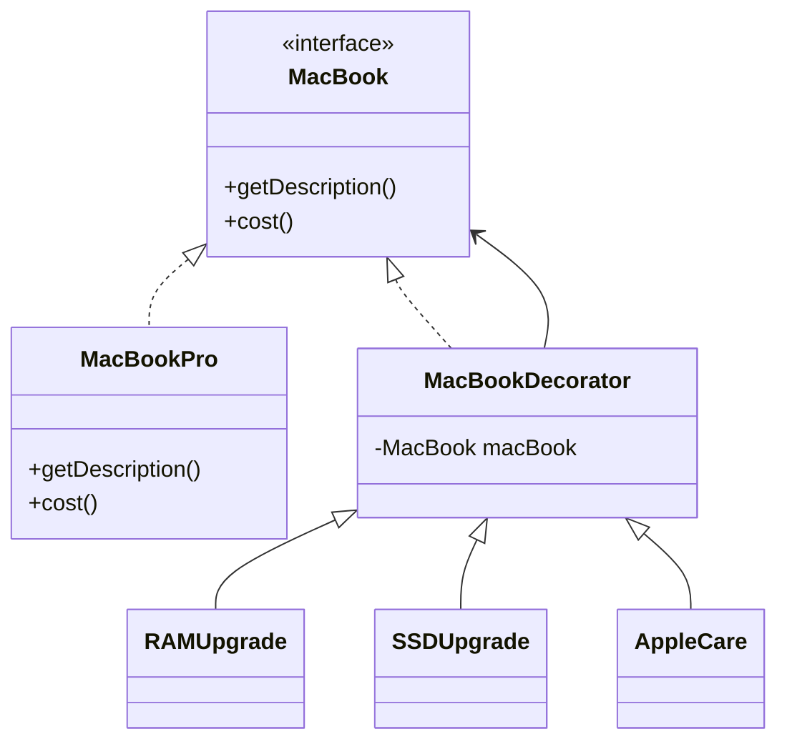
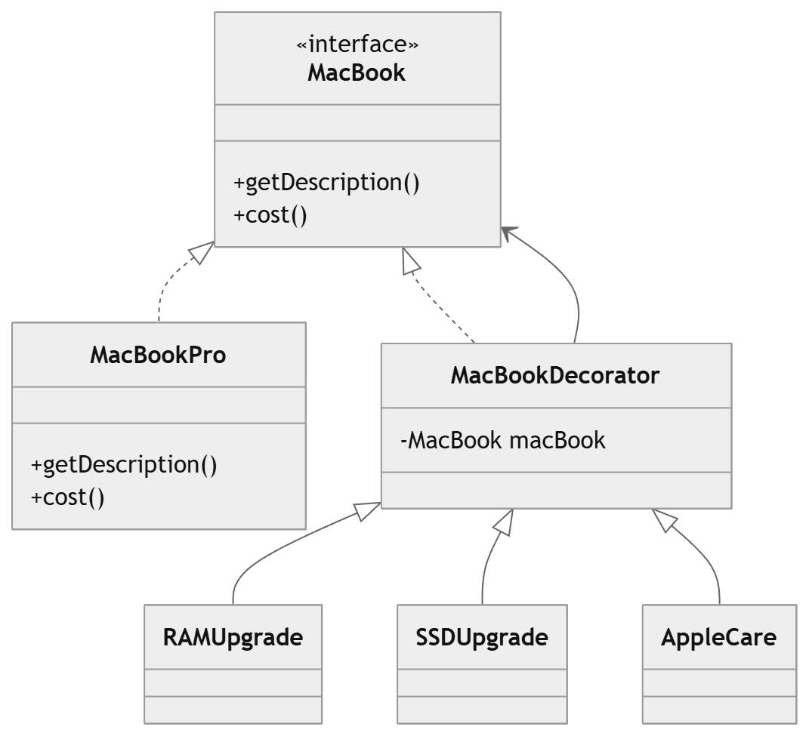

# MacBook Configuration System – Decorator Pattern (LLD)

## Overview

This project demonstrates the **Decorator Design Pattern** using a **MacBook configuration system**.

Customers can start with a **base MacBook** and dynamically add upgrades such as:

* Extra RAM
* Larger SSD
* AppleCare
* GPU Upgrade

Each upgrade **adds additional cost and description** without modifying the base MacBook class.

The **Decorator Pattern** allows us to extend functionality **dynamically at runtime** while following the **Open/Closed Principle**.

---

# Problem Statement

Design a system that allows users to configure a MacBook with optional upgrades.

Example configuration:

```
MacBook Pro + 16GB RAM + 1TB SSD + AppleCare
```

The system should:

* Allow multiple upgrades
* Calculate total price dynamically
* Avoid creating many subclasses

---

# Why Decorator Pattern?

Without decorators, we would need many subclasses like:

```
MacBookPro
MacBookProWith16GBRAM
MacBookProWith16GBRAMAnd1TBSSD
MacBookProWith16GBRAMAnd1TBSSDAndAppleCare
```

This leads to **class explosion**.

Using the **Decorator Pattern**, we can compose upgrades dynamically:

```
MacBook → RAMUpgrade → SSDUpgrade → AppleCare
```

Each decorator wraps the previous object and adds new behavior.

---

# Project Structure

```
MacBook (interface)
      |
MacBookPro (Concrete Component)
      |
MacBookDecorator (Abstract Decorator)
      |
---------------------------------------
|           |             |
RAMUpgrade  SSDUpgrade    AppleCare
```

---

# Implementation

## 1. Component Interface

Defines the base operations.

```java
public interface MacBook {

    String getDescription();

    double cost();
}
```

---

## 2. Concrete Component

Represents the base MacBook product.

```java
public class MacBookPro implements MacBook {

    @Override
    public String getDescription() {
        return "MacBook Pro";
    }

    @Override
    public double cost() {
        return 1999;
    }
}
```

---

## 3. Abstract Decorator

Acts as the base class for all upgrades.

```java
public abstract class MacBookDecorator implements MacBook {

    protected MacBook macBook;

    public MacBookDecorator(MacBook macBook) {
        this.macBook = macBook;
    }

    @Override
    public String getDescription() {
        return macBook.getDescription();
    }

    @Override
    public double cost() {
        return macBook.cost();
    }
}
```

---

## 4. Concrete Decorators

### RAM Upgrade

```java
public class RAMUpgrade extends MacBookDecorator {

    public RAMUpgrade(MacBook macBook) {
        super(macBook);
    }

    @Override
    public String getDescription() {
        return macBook.getDescription() + ", 16GB RAM";
    }

    @Override
    public double cost() {
        return macBook.cost() + 200;
    }
}
```

---

### SSD Upgrade

```java
public class SSDUpgrade extends MacBookDecorator {

    public SSDUpgrade(MacBook macBook) {
        super(macBook);
    }

    @Override
    public String getDescription() {
        return macBook.getDescription() + ", 1TB SSD";
    }

    @Override
    public double cost() {
        return macBook.cost() + 400;
    }
}
```

---

### AppleCare

```java
public class AppleCare extends MacBookDecorator {

    public AppleCare(MacBook macBook) {
        super(macBook);
    }

    @Override
    public String getDescription() {
        return macBook.getDescription() + ", AppleCare";
    }

    @Override
    public double cost() {
        return macBook.cost() + 249;
    }
}
```

---

# Client Example

```java
public class Main {

    public static void main(String[] args) {

        MacBook macBook = new MacBookPro();

        macBook = new RAMUpgrade(macBook);
        macBook = new SSDUpgrade(macBook);
        macBook = new AppleCare(macBook);

        System.out.println(macBook.getDescription());
        System.out.println("Total Price: $" + macBook.cost());
    }
}
```

---

# Example Output

```
MacBook Pro, 16GB RAM, 1TB SSD, AppleCare
Total Price: $2848
```

---

# UML Class Diagram



---

# Execution Flow

```
MacBookPro
     |
RAMUpgrade
     |
SSDUpgrade
     |
AppleCare
```

Each decorator **adds its own behavior** to the wrapped object.

---

# Advantages of This Design

✅ Follows **Open/Closed Principle**
✅ Avoids **subclass explosion**
✅ Allows **dynamic feature composition**
✅ Easy to add new upgrades without modifying existing code

Example: adding a new decorator

```
GPUUpgradeDecorator
```

No existing class needs modification.

---

# Real World Examples of Decorator Pattern

| System        | Example                                          |
| ------------- | ------------------------------------------------ |
| Java I/O      | `BufferedInputStream` wrapping `FileInputStream` |
| UI Frameworks | Scrollbars / Borders added to components         |
| Logging       | Adding logging around services                   |
| E-commerce    | Product add-ons and upgrades                     |

---

# Summary

The **Decorator Pattern** allows behavior to be added to objects **dynamically by wrapping them with decorator classes**.

In this design:

* **Base Component** → `MacBook`
* **Concrete Component** → `MacBookPro`
* **Decorator Base Class** → `MacBookDecorator`
* **Concrete Decorators** → `RAMUpgrade`, `SSDUpgrade`, `AppleCare`

This approach provides **flexibility, scalability, and clean object composition**.

