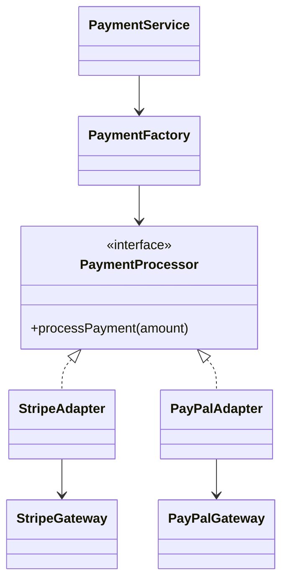
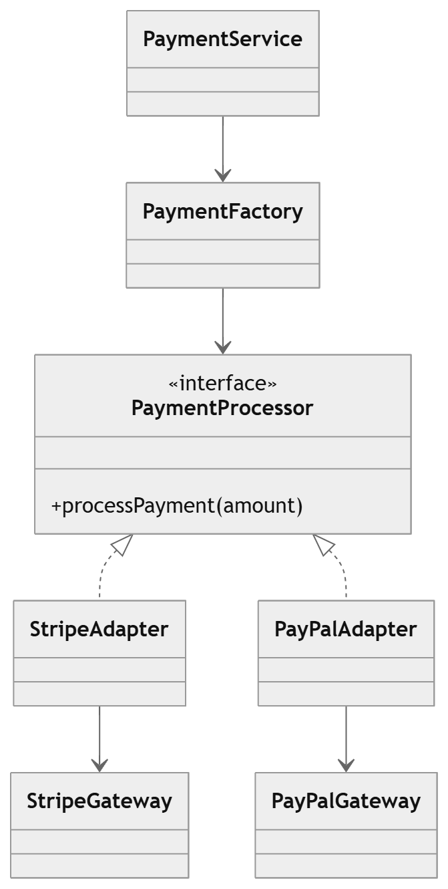

# Payment Gateway Integration using Factory + Adapter + Strategy Patterns

## Overview

This project demonstrates how to design a **flexible and extensible payment gateway integration system** using a combination of three design patterns:

* **Adapter Pattern**
* **Strategy Pattern**
* **Factory Pattern**

Modern applications often need to integrate with multiple **third-party payment providers** such as **Stripe, PayPal, or Razorpay**, each exposing different APIs. This design ensures the application can interact with these providers through a **common interface**, while keeping the system clean, scalable, and maintainable.

---

# Problem Statement

Different payment providers expose **different APIs**.

Example:

| Payment Provider | Method                |
| ---------------- | --------------------- |
| Stripe           | `makePayment(amount)` |
| PayPal           | `sendPayment(amount)` |

However, our application expects a unified interface:

```java
processPayment(amount)
```

This creates an **interface mismatch** between the application and the external services.

---

# Design Solution

To solve this, we combine three design patterns:

| Pattern  | Purpose                                             |
| -------- | --------------------------------------------------- |
| Strategy | Defines the payment behavior interface              |
| Adapter  | Converts third-party APIs into our common interface |
| Factory  | Creates the correct payment strategy dynamically    |

---

# High Level Architecture

```
Client
   |
   v
PaymentService
   |
   v
PaymentFactory
   |
   v
PaymentProcessor (Strategy Interface)
   |
   +-------------------+
   |                   |
StripeAdapter     PayPalAdapter
   |                   |
StripeGateway      PayPalGateway
```

---

# Design Components

## 1. Strategy Interface

Defines the common payment behavior expected by the application.

```java
public interface PaymentProcessor {
    void processPayment(double amount);
}
```

All payment implementations will follow this interface.

---

## 2. Third-Party Gateways (Adaptee)

These represent external payment providers with incompatible APIs.

### Stripe Gateway

```java
public class StripeGateway {

    public void makePayment(double value) {
        System.out.println("Stripe processed payment: " + value);
    }
}
```

### PayPal Gateway

```java
public class PayPalGateway {

    public void sendPayment(double amount) {
        System.out.println("PayPal processed payment: " + amount);
    }
}
```

These APIs cannot be used directly by our application.

---

## 3. Adapter Implementations

Adapters wrap the third-party gateways and convert their APIs into the `PaymentProcessor` interface.

### Stripe Adapter

```java
public class StripeAdapter implements PaymentProcessor {

    private StripeGateway stripeGateway;

    public StripeAdapter(StripeGateway stripeGateway) {
        this.stripeGateway = stripeGateway;
    }

    @Override
    public void processPayment(double amount) {
        stripeGateway.makePayment(amount);
    }
}
```

### PayPal Adapter

```java
public class PayPalAdapter implements PaymentProcessor {

    private PayPalGateway payPalGateway;

    public PayPalAdapter(PayPalGateway payPalGateway) {
        this.payPalGateway = payPalGateway;
    }

    @Override
    public void processPayment(double amount) {
        payPalGateway.sendPayment(amount);
    }
}
```

---

## 4. Factory Pattern

The factory determines which payment strategy to return based on the requested provider.

```java
public class PaymentFactory {

    public static PaymentProcessor getPaymentProcessor(String provider) {

        switch (provider.toLowerCase()) {

            case "stripe":
                return new StripeAdapter(new StripeGateway());

            case "paypal":
                return new PayPalAdapter(new PayPalGateway());

            default:
                throw new IllegalArgumentException("Unsupported payment provider");
        }
    }
}
```

The factory encapsulates object creation logic.

---

## 5. Payment Service

The service layer interacts with the factory and executes the payment.

```java
public class PaymentService {

    public void pay(String provider, double amount) {

        PaymentProcessor processor =
                PaymentFactory.getPaymentProcessor(provider);

        processor.processPayment(amount);
    }
}
```

---

# Client Code

```java
public class Main {

    public static void main(String[] args) {

        PaymentService paymentService = new PaymentService();

        paymentService.pay("stripe", 100);
        paymentService.pay("paypal", 200);
    }
}
```

---

# Example Output

```
Stripe processed payment: 100
PayPal processed payment: 200
```

---

# UML Class Diagram



---

# Execution Flow

```
Client
  |
  v
PaymentService
  |
  v
PaymentFactory
  |
  v
StripeAdapter / PayPalAdapter
  |
  v
Third Party Gateway
```

---

# Benefits of This Design

### 1. Extensibility

New payment providers can be added easily.

Example:

```
RazorpayGateway
RazorpayAdapter
```

Only the factory needs an additional case.

---

### 2. Loose Coupling

The application is **not tightly coupled** with any third-party API.

---

### 3. Clean Separation of Concerns

| Component | Responsibility             |
| --------- | -------------------------- |
| Strategy  | Defines payment behavior   |
| Adapter   | Converts incompatible APIs |
| Factory   | Handles object creation    |
| Service   | Executes business logic    |

---

### 4. Open/Closed Principle

The system can be **extended without modifying existing code**.

---

# When to Use This Pattern Combination

This architecture is commonly used when:

* Integrating **multiple third-party providers**
* Working with **legacy APIs**
* Designing **pluggable systems**
* Supporting **multiple implementations of a service**

Examples include:

* Payment gateway integrations
* Messaging providers
* Cloud storage providers
* Logging systems

---

# Summary

This design combines three powerful design patterns:

* **Strategy Pattern** to define a common payment interface.
* **Adapter Pattern** to integrate third-party APIs.
* **Factory Pattern** to create the correct implementation dynamically.

Together, they create a **scalable, maintainable, and extensible payment integration architecture** suitable for real-world backend systems.
