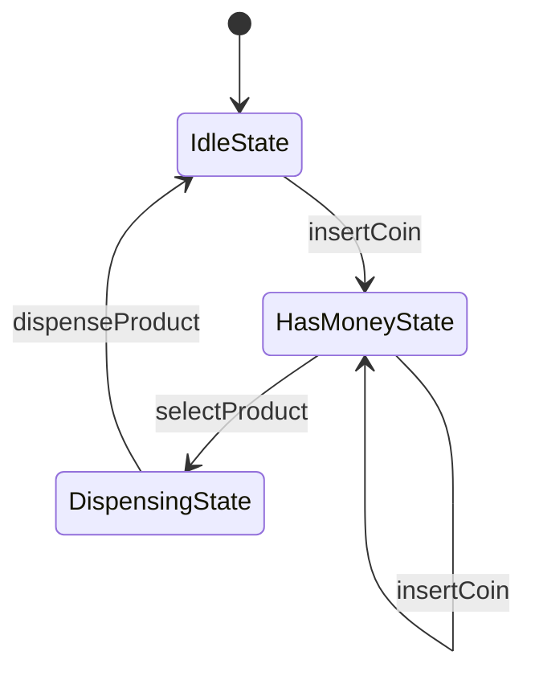

# Vending Machine System (LLD - State Pattern)

## Overview

This project implements a **Vending Machine system** using **Low Level Design (LLD) principles** in Java.

The design demonstrates how the **State Design Pattern** can be used to model systems whose behavior changes depending on their internal state.

A vending machine behaves differently depending on its current state, such as:

* Waiting for coins
* Having money inserted
* Dispensing product
* Out of stock

Instead of using multiple `if-else` statements, the **State Pattern encapsulates behavior into separate classes**.

---

# Design Pattern Used

## State Design Pattern

The **State Pattern** allows an object to change its behavior when its internal state changes.

In this system:

* `VendingMachine` → Context
* `State` → State interface

Concrete states:

* `IdleState`
* `HasMoneyState`
* `DispensingState`

Each state defines how the machine should respond to actions such as inserting coins or selecting a product.

---

# System Components

## 1. VendingMachine (Context)

The `VendingMachine` class maintains:

* Current state
* Product inventory
* Current balance
* Selected product

It delegates behavior to the current state.

### Responsibilities

* Manage machine state
* Track inserted money
* Interact with inventory
* Delegate actions to state classes

---

## 2. State Interface

The `State` interface defines the common actions supported by the vending machine.

Example actions:

* Insert coin
* Select product
* Dispense product

Each state provides its own implementation of these actions.

---

## 3. Concrete States

### IdleState

Machine is waiting for the user to insert a coin.

Allowed actions:

* Insert coin

Invalid actions:

* Selecting product without inserting money

---

### HasMoneyState

User has inserted money and can select a product.

Allowed actions:

* Insert additional coins
* Select product

Invalid actions:

* Dispense product before selection

---

### DispensingState

Machine dispenses the selected product.

Actions:

* Deduct inventory
* Reset balance
* Return to `IdleState`

---

## 4. Product

Represents an item available in the vending machine.

Example attributes:

* Product name
* Product price

---

## 5. Inventory

Manages product storage and availability.

Responsibilities:

* Add products
* Check availability
* Dispense products

---

## 6. Coin

Represents supported coin denominations.

Example values:

* `ONE`
* `FIVE`
* `TEN`

---

# State Diagram

The following diagram shows how the vending machine transitions between states.



### Flow Explanation

1. Machine starts in **IdleState**.
2. User inserts a coin → machine moves to **HasMoneyState**.
3. User selects a product → machine moves to **DispensingState**.
4. Machine dispenses product → returns to **IdleState**.

---

# Example Usage

```java
VendingMachine machine = new VendingMachine();

Product coke = new Product("Coke", 10);

machine.getInventory().addProduct(coke, 5);

machine.insertCoin(Coin.TEN);

machine.selectProduct(coke);

machine.dispense();
```

---

# Execution Flow

```
IdleState
   ↓ insertCoin
HasMoneyState
   ↓ selectProduct
DispensingState
   ↓ dispense
IdleState
```

---

# Advantages of This Design

* Eliminates complex conditional logic
* Encapsulates behavior in separate classes
* Easy to add new states
* Follows **Open/Closed Principle**
* Improves maintainability

---

# Possible Enhancements

The design can be extended with additional features such as:

* Returning change
* Supporting multiple products
* Out-of-stock state
* Cancel transaction
* Multiple coin types
* Machine maintenance mode

---

# Technologies Used

* Java
* Object-Oriented Programming
* Design Patterns

    * **State Pattern**
