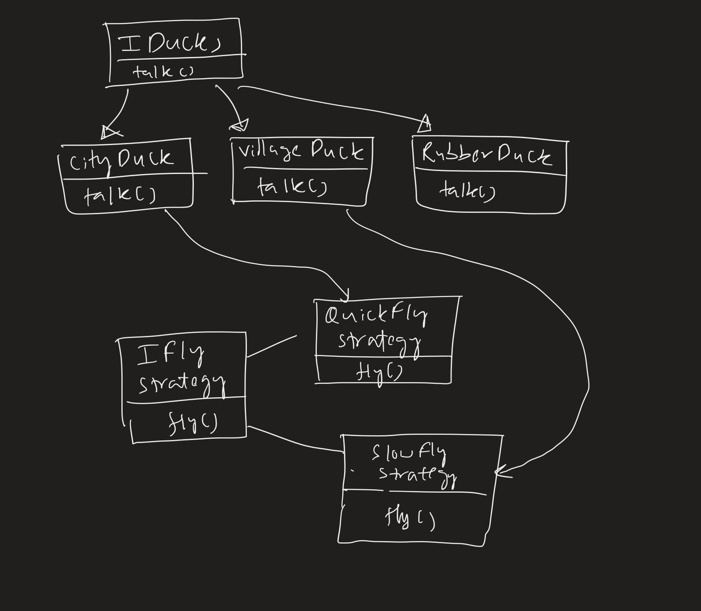

# Strategy Pattern

Decouple algorithm from client classes.

We have 3 types of `Ducks`- `CityDucks`, `VillageDucks` and `RubberDucks`.

Now all the 3 ducks can `talk` but the `RubberDucks` can't `fly`.

One way to implement this is that `IDucks` can have both `talk` and the `fly` methods. The concrete classes implement them.
The `RubberDucks` can have an empty `fly` function. This is bad practice. This is happening because,

                        IDucks
                        /  |  \
                       /   |   \
                      /    |    \
                     /     |     \
                    /      |      \
                   /       |       \
                  /        |        \
                 /         |         \
             CityDucks  VillageDucks RubberDucks

The problem is that the relationship between the `CityDucks`, `VillageDucks` and that of IDucks is 
definitely that of parent-child. But, `RubberDucks` doesn't have the `fly` method, yet we are inheriting
`RubberDucks` from `IDucks`. The problem is inheritance, the child class does not have all the methods of the parent class.

Thus, we move the parent class's methods which are not present in all child classes i.e. `IDucks` should not have `fly`.
We thus, have the following:

